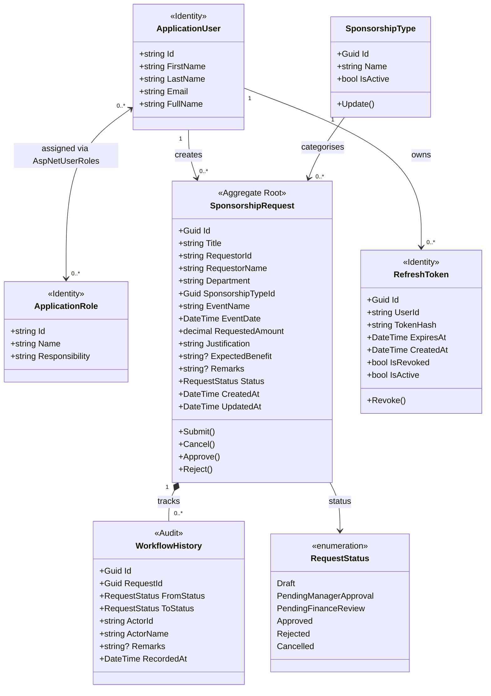

# Sponsorship Request Approval Workflow

Senior Full Stack .NET Developer Technical Assessment

## Tech Stack

| Layer | Technology |
|---|---|
| Backend | .NET 9, ASP.NET Core Web API |
| Architecture | Clean Architecture, CQRS, Rich Domain Model |
| ORM | Entity Framework Core 9, PostgreSQL |
| Auth | ASP.NET Core Identity, JWT Bearer, Refresh Token Rotation |
| Validation | FluentValidation (MediatR pipeline behaviour) |
| Frontend | Angular 19, Angular Material |
| Containerization | Docker Compose |
| API Docs | Swagger / OpenAPI |

---

## Architecture Overview

```
sponsorship-workflow/
├── backend/
│   ├── SponsorshipWorkflow.Domain/         # Entities, enums, domain events, Result<T>
│   ├── SponsorshipWorkflow.Application/    # CQRS commands/queries, validators, interfaces
│   ├── SponsorshipWorkflow.Infrastructure/ # EF Core, Identity, JWT, token service, seeding
│   └── SponsorshipWorkflow.API/            # Controllers, middleware, policies, DI wiring
├── sponsorship-app/                        # Angular frontend
└── docker-compose.yml
```

Dependency rule: each layer only depends inward. Domain has zero external dependencies.

---

## Design Patterns

| Pattern | Implementation |
|---|---|
| **Clean Architecture** | Domain → Application → Infrastructure → API; no upward dependencies |
| **Rich Domain Model** | Business rules enforced inside entities via private setters and domain methods; handlers are thin orchestrators |
| **CQRS with MediatR 12** | Commands return `Result`/`Result<T>`, queries return response types; pipeline validates before handler runs |
| **Domain Events** | `RequestStatusChangedEvent` fires on every status change; `WorkflowHistoryFactory` materialises audit records |
| **State Machine** | `SponsorshipRequest.Approve/Reject/Submit/Cancel` enforce valid transitions by `(Status, role)` pair |
| **Policy-Based Authorization** | `Policies.IsRequestor`, `Policies.CanApprove`, `Policies.IsSystemAdmin` — adding a new approver role is a one-line policy change |
| **Refresh Token Rotation** | Each use of a refresh token revokes it and issues a new one; tokens stored as SHA-256 hashes |
| **Optimistic Concurrency** | PostgreSQL `xmin` system column used as EF Core concurrency token — no extra column needed |

---

## Workflow State Machine

```
Draft ──[Submit]──► PendingManagerApproval
                          │
               [Approve] ─┤─ [Reject] ──► Rejected
                          ▼
                   PendingFinanceReview
                          │
               [Approve] ─┤─ [Reject] ──► Rejected
                          ▼
                       Approved

Any non-final state ──[Cancel]──► Cancelled
```

Transitions are enforced inside the domain entity, not in handlers. A Manager can only act on `PendingManagerApproval`; a FinanceAdmin on `PendingFinanceReview`. A user with both roles sees both queues merged via a single `GET /pending` endpoint.

---

## Entity Diagram



> `WorkflowHistory.ActorId` is not a FK — avoids a runtime join on every audit read. `ActorName` is denormalised at write time so history stays accurate even if the user's name changes later.

---

## Running with Docker Compose (Recommended)

> Prerequisites: Docker Desktop installed and running

```bash
cd sponsorship-workflow

# Build and start all services (PostgreSQL + API + Frontend)
docker-compose up --build
```

On first run this will:
- Start PostgreSQL
- Run all EF Core migrations automatically
- Seed roles, test accounts, and sponsorship types
- Serve the Angular app at http://localhost:80
- Serve the API at http://localhost:5001

**Access points**

| Service | URL |
|---|---|
| Frontend | http://localhost |
| API Swagger | http://localhost:5001/swagger |
| PostgreSQL | localhost:5432 |

---

## Running Locally (Without Docker)

**Prerequisites:** .NET 9 SDK · Node.js 22+ · PostgreSQL 14+

### Backend

```bash
cd backend

# Update connection string in SponsorshipWorkflow.API/appsettings.json if needed
# Migrations and seed data run automatically on startup

dotnet run --project SponsorshipWorkflow.API
# API: http://localhost:5001
# Swagger: http://localhost:5001/swagger
```

### Frontend

```bash
cd sponsorship-app

npm install
ng serve
# Frontend: http://localhost:4200
```

---

## Test Accounts

| Email | Password | Role | Capabilities |
|---|---|---|---|
| requestor@test.com | Test@123! | Requestor | Create, edit, submit, cancel own requests |
| manager@test.com | Test@123! | Manager | View pending queue, approve/reject at manager stage |
| finance@test.com | Test@123! | Finance Admin | View pending queue, approve/reject at finance stage |
| admin@test.com | Test@123! | System Admin | View all requests, manage sponsorship types |

Password policy: minimum 8 characters, requires uppercase, digit, and special character.

---

## API Endpoints

### Auth

| Method | Endpoint | Auth | Description |
|---|---|---|---|
| POST | /api/auth/login | Public | Returns access token (5 min) + refresh token (10 days) |
| POST | /api/auth/refresh | Public | Rotates refresh token, returns new token pair |
| POST | /api/auth/logout | Authenticated | Revokes all refresh tokens for the current user |

### Sponsorship Requests

| Method | Endpoint | Policy | Description |
|---|---|---|---|
| GET | /api/sponsorshiprequests | SystemAdmin | All requests |
| GET | /api/sponsorshiprequests/my | Requestor | Own requests |
| GET | /api/sponsorshiprequests/{id} | Owner / Approver | Single request (404 for unauthorized — no ID enumeration) |
| POST | /api/sponsorshiprequests | Requestor | Create draft |
| PUT | /api/sponsorshiprequests/{id} | Requestor | Update draft |
| POST | /api/sponsorshiprequests/{id}/submit | Requestor | Submit for approval |
| POST | /api/sponsorshiprequests/{id}/cancel | Requestor | Cancel |
| GET | /api/sponsorshiprequests/pending | CanApprove | Pending queue (merged for multi-role users) |
| POST | /api/sponsorshiprequests/{id}/approve | CanApprove | Approve (stage determined by entity state machine) |
| POST | /api/sponsorshiprequests/{id}/reject | CanApprove | Reject (reason required) |

### Sponsorship Types

| Method | Endpoint | Policy | Description |
|---|---|---|---|
| GET | /api/sponsorshiptypes | Authenticated | List types (activeOnly=true by default) |
| POST | /api/sponsorshiptypes | SystemAdmin | Create type |
| PUT | /api/sponsorshiptypes/{id} | SystemAdmin | Update / deactivate type |

---

## Token Flow

```
POST /api/auth/login
  └─► { accessToken (5 min), refreshToken (10 days), ... }

          [access token expires]

POST /api/auth/refresh  { refreshToken }
  └─► { new accessToken, new refreshToken }   ← old refresh token revoked
          (rotation: stolen token can only be used once)

POST /api/auth/logout
  └─► all refresh tokens for user revoked
```

Refresh tokens are stored as **SHA-256 hashes** — a stolen database snapshot cannot be used to forge tokens.

---

## Identity Model

```
ApplicationUser : IdentityUser
  + FirstName, LastName  (DB columns on AspNetUsers)
  + FullName             (computed, stored in JWT claim — no DB call per request)

ApplicationRole : IdentityRole
  + Responsibility       (DB column on AspNetRoles, seeded per role)
```

---

## Architecture Decisions

### Why Policy-Based Authorization
`[Authorize(Policy = "CanApprove")]` maps to `RequireRole(Manager, FinanceAdmin)` in one place. Adding a new approver role means changing the policy definition, not hunting through every controller attribute.

### Why Unified `/approve` and `/reject` Endpoints
The state machine in `SponsorshipRequest` determines which stage an actor can act on based on `(Status, actorRoles)`. Role-specific endpoints (`/manager-approve`, `/finance-approve`) would need a new endpoint for every new role added.

### Why Domain Events for Audit
`SponsorshipRequest.ChangeStatus()` fires `RequestStatusChangedEvent`. Every command handler gets a free, accurate audit record without explicitly building it. It is impossible to change status without creating history.

### Why `xmin` for Concurrency
PostgreSQL increments `xmin` on every row write at the engine level. EF Core appends `WHERE xmin = <read_value>` to every UPDATE. No extra column, no application-side versioning, and the database guarantees correctness.

### Why Refresh Token Hashing
Storing plaintext refresh tokens means a single database breach gives an attacker access to all active sessions. Storing hashes means the breach is useless without the original token (which never touches the database).

---